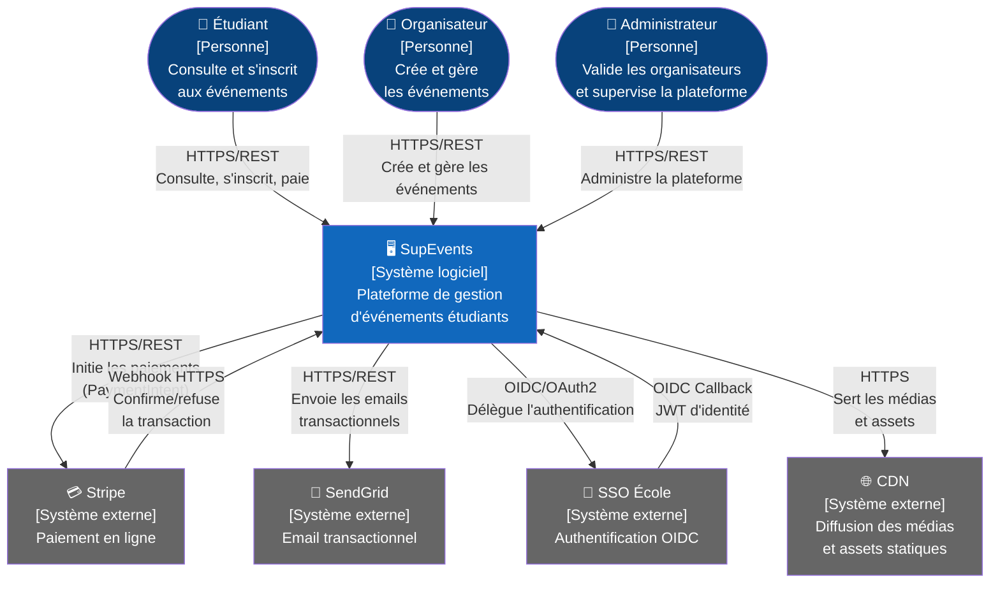
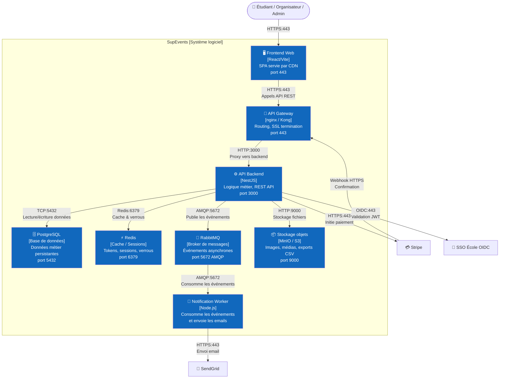
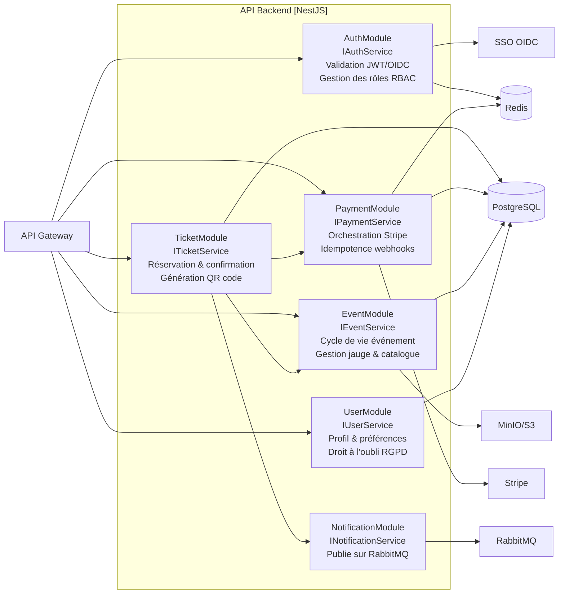

# §6.1 — Vue logique

## 6.1.1 Diagramme C4 Context

Ce diagramme présente la vue grand-angle du système SupEvents, tel qu'il est perçu par ses utilisateurs et les systèmes tiers avec lesquels il interagit. Il est destiné aux décideurs métier et aux nouveaux membres de l'équipe souhaitant comprendre le positionnement du système sans entrer dans les détails techniques.

SupEvents est le point de coordination central : il ne gère pas les identités (délégué au SSO OIDC de l'école) ni le transport des paiements (délégué à Stripe). Ce choix de délégation permet de rester hors du périmètre PCI-DSS et de réutiliser les comptes institutionnels existants des étudiants. Le CDN sert les assets statiques du frontend, déchargeant l'API backend des requêtes de ressources statiques.

---

## 6.1.2 Diagramme C4 Containers

Ce diagramme zoome à l'intérieur de SupEvents pour montrer les blocs déployables qui le composent. Il est destiné aux développeurs et architectes qui doivent comprendre la décomposition technique du système et les technologies retenues.

L'architecture en containers sépare clairement les préoccupations : le frontend React est une SPA statique servie par CDN, l'API Gateway centralise le routage et la terminaison SSL, le backend NestJS porte toute la logique métier. La communication asynchrone via RabbitMQ découple le service de notification du flux critique d'inscription — une panne du worker de notification n'empêche pas un étudiant de finaliser son inscription. Redis est utilisé à la fois pour le cache des sessions JWT et pour les verrous distribués sur la gestion des places.

---

## 6.1.3 Diagramme de composants — API Backend

Ce diagramme décompose l'intérieur du container API Backend en modules fonctionnels. Il est destiné aux développeurs qui implémentent les modules et qui doivent comprendre les dépendances internes.

Les dépendances sont tracées selon les règles métier réelles : `TicketModule` dépend de `EventModule` (vérification des places disponibles) et de `PaymentModule` (initiation du paiement), mais pas directement de `NotificationModule` — le découplage est assuré via RabbitMQ. `AuthModule` est transverse et consulté par tous les modules pour la validation RBAC, mais n'est pas représenté comme dépendance directe de chaque module pour ne pas surcharger le diagramme.

---

*Dernière mise à jour : 2026-05-13*
