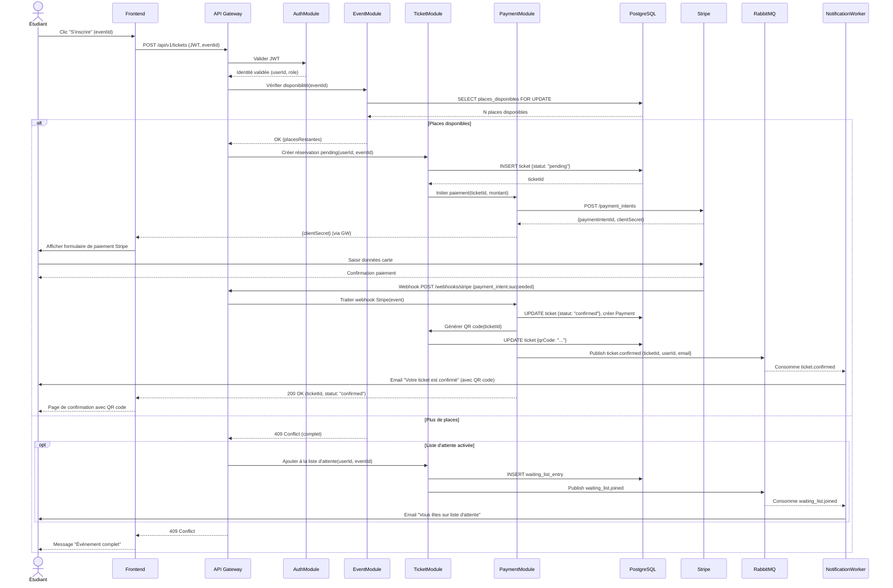
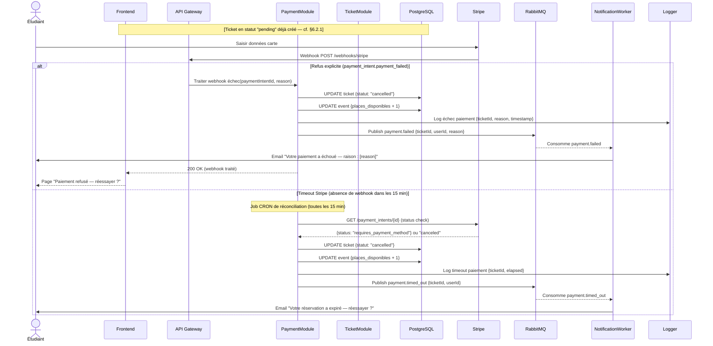

# §6.2 — Vue des processus

## 6.2.1 Diagramme de séquence : Inscription à un événement (parcours nominal)

Ce diagramme couvre le flux complet déclenché lorsqu'un étudiant clique sur "S'inscrire" jusqu'à la réception de son ticket par email. Il est destiné aux développeurs qui implémentent les modules `TicketModule` et `PaymentModule`, et sert de référence pour les tests d'intégration du parcours critique.

Les points clés de ce flux : le verrou `SELECT FOR UPDATE` sur les places garantit l'absence de surbooking même en cas de requêtes concurrentes. La réservation est créée en statut `pending` avant le paiement — si le paiement échoue, le ticket est annulé et la place libérée (cf. §6.2.2). La notification est découplée via RabbitMQ : une indisponibilité de SendGrid ne bloque pas la confirmation du ticket.

---

## 6.2.2 Diagramme de séquence : Échec de paiement

Ce diagramme reprend le flux d'inscription jusqu'à l'étape de paiement Stripe, mais traite les cas d'erreur. Il est destiné aux développeurs du `PaymentModule` et aux testeurs qui doivent couvrir les scénarios d'échec dans les tests d'intégration.

Les deux cas d'échec (refus explicite et timeout) mènent au même résultat : le ticket passe en `cancelled` et la place est restituée atomiquement. La distinction entre les deux flux est importante pour la notification : en cas de refus, la raison métier est communiquée à l'étudiant (carte refusée, fonds insuffisants) ; en cas de timeout, le message est plus générique. Le job CRON de réconciliation garantit qu'aucune réservation ne reste indéfiniment en `pending` même si le webhook Stripe est perdu.

---

*Dernière mise à jour : 2026-05-13*
