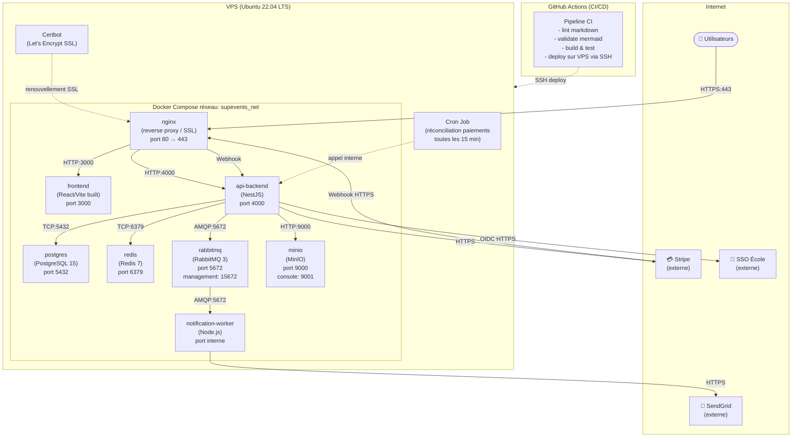

# §6.3 — Vue de déploiement

## 6.3.1 Infrastructure cible

SupEvents est déployé sur un VPS single-region en raison des contraintes budgétaires du projet. L'orchestration des containers est assurée par Docker Compose en production initiale. Ce diagramme est destiné à l'équipe DevOps et aux développeurs responsables du pipeline CI/CD.

Le trafic HTTPS entrant est terminé par nginx, qui route vers le frontend statique ou l'API backend selon le préfixe de chemin (`/api/v1/` → backend, `/webhooks/` → backend, reste → frontend). Le réseau Docker interne (`supevents_net`) isole les containers entre eux et du réseau hôte. Les ports de management (RabbitMQ 15672, MinIO 9001) ne sont exposés qu'en interne ou via VPN pour des raisons de sécurité.

## 6.3.2 Variables d'environnement critiques

| Variable | Service | Description |
|----------|---------|-------------|
| `DATABASE_URL` | api-backend | URI de connexion PostgreSQL |
| `REDIS_URL` | api-backend | URI de connexion Redis |
| `RABBITMQ_URL` | api-backend, worker | URI de connexion AMQP |
| `STRIPE_SECRET_KEY` | api-backend | Clé secrète Stripe (production) |
| `STRIPE_WEBHOOK_SECRET` | api-backend | Secret de validation des webhooks Stripe |
| `OIDC_ISSUER_URL` | api-backend | URL du serveur OIDC de l'école |
| `SENDGRID_API_KEY` | notification-worker | Clé API SendGrid |
| `JWT_SECRET` | api-backend | Secret de signature JWT applicatif |
| `MINIO_ROOT_USER` | minio, api-backend | Credentials MinIO |

---

*Dernière mise à jour : 2026-05-13*
