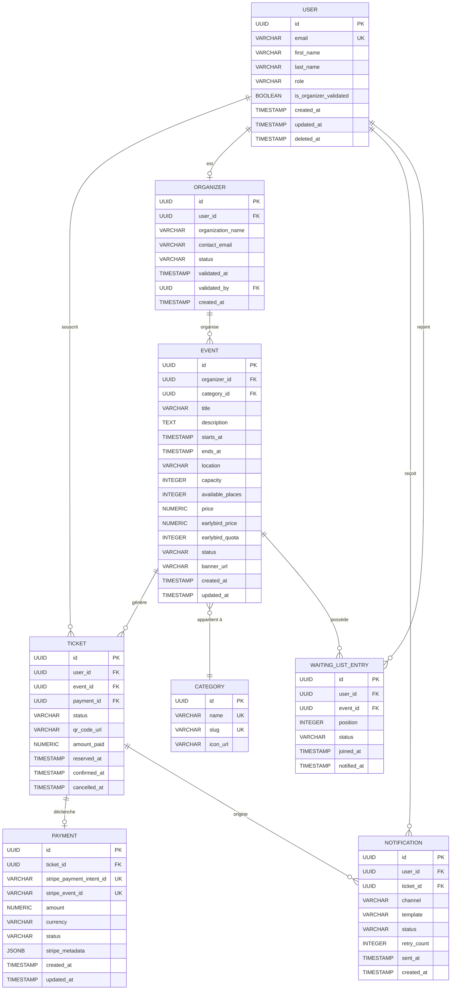

# §6.4 — Vue des données

## 6.4.1 Diagramme entité-relation

Ce diagramme représente le modèle de données complet de SupEvents. Il est la référence contractuelle pour tous les développements backend et les migrations de base de données. Il est destiné aux développeurs NestJS et au DBA responsable de PostgreSQL.

La relation `USER ↔ EVENT` n'est pas directe : un utilisateur s'inscrit à un événement via une entité `TICKET` de plein droit. `PAYMENT` est séparée de `TICKET` pour permettre la gestion de l'idempotence des webhooks Stripe via le champ `stripe_event_id`. L'entité `WAITING_LIST_ENTRY` gère les listes d'attente ordonnées par position.

---

## 6.4.2 Dictionnaire de données

### Table `user`

| Champ | Type | Contraintes | Description | Sensibilité RGPD |
|-------|------|-------------|-------------|------------------|
| `id` | `UUID` | PK, NOT NULL, DEFAULT gen_random_uuid() | Identifiant unique de l'utilisateur | Non |
| `email` | `VARCHAR(255)` | UK, NOT NULL | Adresse email institutionnelle (SSO) | **Oui** |
| `first_name` | `VARCHAR(100)` | NOT NULL | Prénom | **Oui** |
| `last_name` | `VARCHAR(100)` | NOT NULL | Nom de famille | **Oui** |
| `role` | `VARCHAR(20)` | NOT NULL, CHECK (role IN ('student','organizer','admin')) | Rôle RBAC | Non |
| `is_organizer_validated` | `BOOLEAN` | NOT NULL, DEFAULT false | Statut de validation organisateur | Non |
| `created_at` | `TIMESTAMP` | NOT NULL, DEFAULT now() | Date de création du compte | Non |
| `updated_at` | `TIMESTAMP` | NOT NULL, DEFAULT now() | Date de dernière modification | Non |
| `deleted_at` | `TIMESTAMP` | NULL | Soft delete pour le droit à l'oubli RGPD | Non |

> **Note RGPD** : Les champs `email`, `first_name`, `last_name` sont des données à caractère personnel. En cas d'exercice du droit à l'oubli, ces champs sont pseudonymisés (`deleted_user_[uuid]@anonymized.local`, `Anonyme`, `Utilisateur`) et `deleted_at` est renseigné. La suppression physique n'est pas effectuée pour préserver l'intégrité référentielle des `TICKET` archivés.

### Table `event`

| Champ | Type | Contraintes | Description | Sensibilité RGPD |
|-------|------|-------------|-------------|------------------|
| `id` | `UUID` | PK, NOT NULL | Identifiant unique de l'événement | Non |
| `organizer_id` | `UUID` | FK → organizer.id, NOT NULL | Organisateur créateur | Non |
| `category_id` | `UUID` | FK → category.id | Catégorie de l'événement | Non |
| `title` | `VARCHAR(255)` | NOT NULL | Titre public de l'événement | Non |
| `description` | `TEXT` | NOT NULL | Description longue | Non |
| `starts_at` | `TIMESTAMP` | NOT NULL | Date et heure de début | Non |
| `ends_at` | `TIMESTAMP` | NOT NULL, CHECK (ends_at > starts_at) | Date et heure de fin | Non |
| `location` | `VARCHAR(255)` | NOT NULL | Lieu de l'événement | Non |
| `capacity` | `INTEGER` | NOT NULL, CHECK (capacity > 0) | Capacité maximale totale | Non |
| `available_places` | `INTEGER` | NOT NULL, CHECK (available_places >= 0) | Places restantes (décrémentées via verrou) | Non |
| `price` | `NUMERIC(10,2)` | NOT NULL, CHECK (price >= 0) | Prix standard en EUR | Non |
| `earlybird_price` | `NUMERIC(10,2)` | NULL, CHECK (earlybird_price < price) | Prix earlybird en EUR | Non |
| `earlybird_quota` | `INTEGER` | NULL, CHECK (earlybird_quota > 0) | Nombre de billets earlybird disponibles | Non |
| `status` | `VARCHAR(20)` | NOT NULL, CHECK (status IN ('draft','published','cancelled','archived')) | Statut du cycle de vie | Non |
| `banner_url` | `VARCHAR(500)` | NULL | URL CDN de l'image de couverture | Non |
| `created_at` | `TIMESTAMP` | NOT NULL, DEFAULT now() | Date de création | Non |
| `updated_at` | `TIMESTAMP` | NOT NULL, DEFAULT now() | Date de dernière modification | Non |

### Table `ticket`

| Champ | Type | Contraintes | Description | Sensibilité RGPD |
|-------|------|-------------|-------------|------------------|
| `id` | `UUID` | PK, NOT NULL | Identifiant unique du ticket | Non |
| `user_id` | `UUID` | FK → user.id, NOT NULL | Détenteur du ticket | Non |
| `event_id` | `UUID` | FK → event.id, NOT NULL | Événement concerné | Non |
| `payment_id` | `UUID` | FK → payment.id, NULL | Paiement associé (NULL si gratuit) | Non |
| `status` | `VARCHAR(20)` | NOT NULL, CHECK (status IN ('pending','confirmed','cancelled','refunded')) | Statut du ticket | Non |
| `qr_code_url` | `VARCHAR(500)` | NULL | URL du QR code (généré à la confirmation) | Non |
| `amount_paid` | `NUMERIC(10,2)` | NOT NULL | Montant effectivement payé | Non |
| `reserved_at` | `TIMESTAMP` | NOT NULL, DEFAULT now() | Date de réservation (création pending) | Non |
| `confirmed_at` | `TIMESTAMP` | NULL | Date de confirmation après paiement | Non |
| `cancelled_at` | `TIMESTAMP` | NULL | Date d'annulation | Non |

### Table `payment`

| Champ | Type | Contraintes | Description | Sensibilité RGPD |
|-------|------|-------------|-------------|------------------|
| `id` | `UUID` | PK, NOT NULL | Identifiant interne | Non |
| `ticket_id` | `UUID` | FK → ticket.id, NOT NULL | Ticket associé | Non |
| `stripe_payment_intent_id` | `VARCHAR(100)` | UK, NOT NULL | ID PaymentIntent Stripe | Non |
| `stripe_event_id` | `VARCHAR(100)` | UK, NULL | ID de l'événement webhook Stripe (idempotence) | Non |
| `amount` | `NUMERIC(10,2)` | NOT NULL | Montant en EUR | Non |
| `currency` | `VARCHAR(3)` | NOT NULL, DEFAULT 'EUR' | Devise ISO 4217 | Non |
| `status` | `VARCHAR(30)` | NOT NULL | Statut Stripe (requires_payment_method, succeeded, failed...) | Non |
| `stripe_metadata` | `JSONB` | NULL | Métadonnées brutes du webhook (pour audit) | Non |
| `created_at` | `TIMESTAMP` | NOT NULL, DEFAULT now() | Date de création | Non |
| `updated_at` | `TIMESTAMP` | NOT NULL, DEFAULT now() | Date de dernière modification | Non |

> **Note PCI-DSS** : Aucune donnée de carte bancaire (PAN, CVV, date d'expiration) n'est stockée dans cette table. `stripe_payment_intent_id` est un identifiant opaque Stripe sans valeur de carte. La conformité PCI-DSS est entièrement déléguée à Stripe.

### Table `notification`

| Champ | Type | Contraintes | Description | Sensibilité RGPD |
|-------|------|-------------|-------------|------------------|
| `id` | `UUID` | PK, NOT NULL | Identifiant de la notification | Non |
| `user_id` | `UUID` | FK → user.id, NOT NULL | Destinataire | Non |
| `ticket_id` | `UUID` | FK → ticket.id, NULL | Ticket concerné si applicable | Non |
| `channel` | `VARCHAR(20)` | NOT NULL, CHECK (channel IN ('email','in_app')) | Canal de notification | Non |
| `template` | `VARCHAR(50)` | NOT NULL | Identifiant du template (ex: 'ticket.confirmed') | Non |
| `status` | `VARCHAR(20)` | NOT NULL, CHECK (status IN ('pending','sent','failed','dlq')) | Statut d'envoi | Non |
| `retry_count` | `INTEGER` | NOT NULL, DEFAULT 0 | Nombre de tentatives d'envoi | Non |
| `sent_at` | `TIMESTAMP` | NULL | Date d'envoi effectif | Non |
| `created_at` | `TIMESTAMP` | NOT NULL, DEFAULT now() | Date de création | Non |

### Table `organizer`

| Champ | Type | Contraintes | Description | Sensibilité RGPD |
|-------|------|-------------|-------------|------------------|
| `id` | `UUID` | PK, NOT NULL | Identifiant de l'organisateur | Non |
| `user_id` | `UUID` | FK → user.id, UK, NOT NULL | Utilisateur lié | Non |
| `organization_name` | `VARCHAR(200)` | NOT NULL | Nom de l'association ou du club | Non |
| `contact_email` | `VARCHAR(255)` | NOT NULL | Email de contact public | **Oui** |
| `status` | `VARCHAR(20)` | NOT NULL, CHECK (status IN ('pending','validated','revoked')) | Statut de validation | Non |
| `validated_at` | `TIMESTAMP` | NULL | Date de validation par l'admin | Non |
| `validated_by` | `UUID` | FK → user.id, NULL | Admin ayant validé | Non |
| `created_at` | `TIMESTAMP` | NOT NULL, DEFAULT now() | Date de création | Non |

> **Note RGPD** : `contact_email` est une donnée personnelle. Elle est utilisée pour les communications liées à l'organisation des événements.

---

## 6.4.3 Justification du stockage

| Technologie | Données stockées | Justification |
|-------------|-----------------|---------------|
| **PostgreSQL** | Toutes les entités métier | Garanties ACID nécessaires pour la gestion concurrentielle des places (`SELECT FOR UPDATE`) et l'intégrité des paiements. |
| **Redis** | Sessions JWT, verrous distribués (TTL 15min) | Accès sub-milliseconde pour la validation de tokens à chaque requête authentifiée ; verrous distribués sur `event.available_places` pour la gestion de la concurrence. |
| **MinIO (S3)** | Images d'événements, QR codes, exports CSV | Stockage objet scalable hors base de données. Les fichiers binaires ne doivent pas être stockés en PostgreSQL. |
| **RabbitMQ** | Messages asynchrones (tickets, paiements, notifications) | Découplage du flux critique d'inscription du flux de notification. Garantie de livraison via ACK/NACK + Dead Letter Queue. |

---

*Dernière mise à jour : 2026-05-13*
