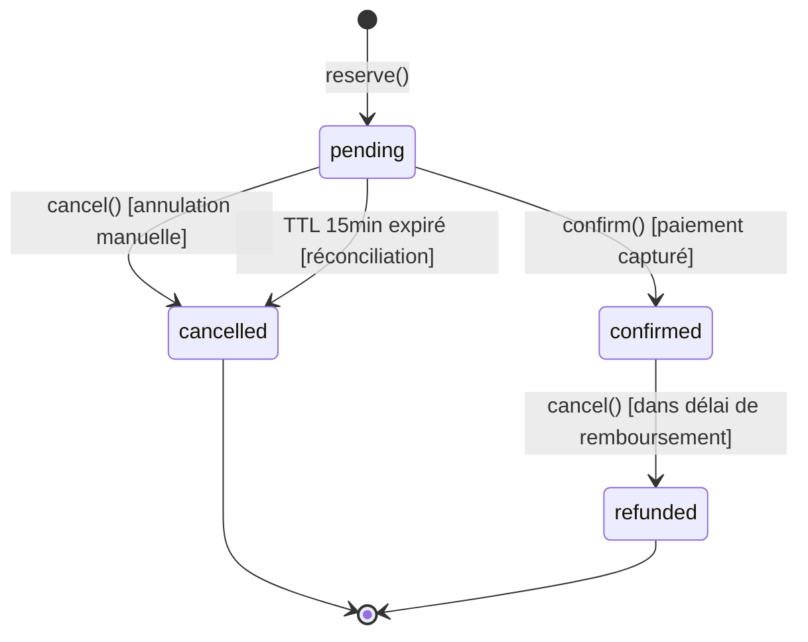
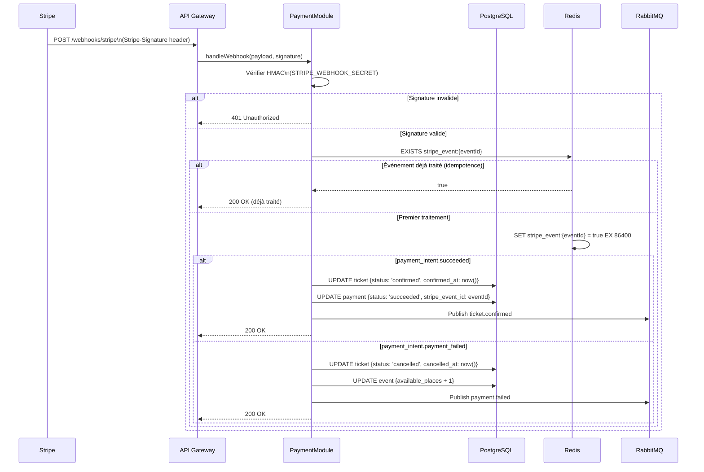

# §7 — Conception détaillée des modules

## 7.1 TicketModule

### Rôle et responsabilités

`TicketModule` orchestre le cycle de vie complet d'un billet étudiant, de la réservation initiale (statut `pending`) jusqu'à la confirmation, l'annulation ou le remboursement. Il est le coordinateur central du parcours d'inscription : il fait appel à `EventModule` pour vérifier les places, à `PaymentModule` pour initier le paiement, et publie les événements asynchrones vers `NotificationModule` via RabbitMQ.

### Interface principale

```typescript
interface ITicketService {
  reserve(dto: ReserveTicketDto): Promise<TicketEntity>;
  confirm(ticketId: string, paymentId: string): Promise<TicketEntity>;
  cancel(ticketId: string, userId: string): Promise<void>;
  generateQrCode(ticketId: string): Promise<string>;
  findById(ticketId: string, userId: string): Promise<TicketEntity>;
}
```

### Diagramme d'états



### Algorithme de réservation concurrentielle

Le scénario critique est la tentative simultanée de deux étudiants de réserver la dernière place disponible. L'algorithme garantit l'absence de surbooking via un verrou pessimiste PostgreSQL.

```
FONCTION reserve(userId, eventId, price):
  DÉBUT TRANSACTION
    event = SELECT * FROM events WHERE id = eventId FOR UPDATE
    
    SI event.available_places <= 0:
      SI event.waiting_list_enabled:
        RETOURNER addToWaitingList(userId, eventId)
      SINON:
        LEVER ConflictException("Événement complet")
    
    SI event.earlybird_quota > 0 ET event.earlybird_price < price:
      montant = event.earlybird_price
      UPDATE events SET earlybird_quota = earlybird_quota - 1 WHERE id = eventId
    SINON:
      montant = event.price
    
    UPDATE events SET available_places = available_places - 1 WHERE id = eventId
    
    ticket = INSERT INTO tickets {
      user_id: userId,
      event_id: eventId,
      status: 'pending',
      amount_paid: montant,
      reserved_at: NOW()
    }
  FIN TRANSACTION
  
  PLANIFIER annulation si non confirmé dans 15 minutes (TTL Redis)
  RETOURNER ticket
FIN
```

### Cas limites documentés

| Scénario | Comportement décidé |
|----------|---------------------|
| Double-clic sur "S'inscrire" | Idempotence via vérification d'un ticket `pending` existant pour (userId, eventId) — retourne le ticket existant sans créer de doublon. |
| Dernière place restante, deux requêtes simultanées | Le `SELECT FOR UPDATE` garantit qu'un seul ticket est créé. Le second reçoit 409 Conflict. |
| Annulation d'un ticket après paiement capturé | Remboursement Stripe via `refunds.create`, ticket passe en `refunded`, place restituée. Uniquement possible dans les 48h suivant la confirmation. |
| Événement annulé par l'organisateur | Tous les tickets `confirmed` passent en `refunded` par traitement batch, remboursements Stripe en masse, notifications aux étudiants. |

---

## 7.2 PaymentModule

### Rôle et responsabilités

`PaymentModule` orchestre l'intégration avec Stripe : création des `PaymentIntent`, réception et validation des webhooks, gestion de l'idempotence, et réconciliation périodique des paiements orphelins. Il ne stocke aucune donnée de carte et délègue l'interface de paiement à Stripe.js côté frontend.

### Interface principale

```typescript
interface IPaymentService {
  createPaymentIntent(ticketId: string, amount: number): Promise<PaymentIntentResult>;
  handleWebhook(payload: Buffer, signature: string): Promise<void>;
  refund(ticketId: string): Promise<void>;
  reconcileOrphanedPayments(): Promise<void>;
}
```

### Diagramme de séquence — Traitement webhook Stripe



### Algorithme de réconciliation des paiements orphelins

```
FONCTION reconcileOrphanedPayments():
  // Exécuté par CRON toutes les 15 minutes
  
  tickets_pending = SELECT * FROM tickets 
    WHERE status = 'pending' 
    AND reserved_at < NOW() - INTERVAL '15 minutes'
  
  POUR CHAQUE ticket EN tickets_pending:
    payment_intent = Stripe.retrieve(ticket.stripe_payment_intent_id)
    
    SI payment_intent.status IN ['canceled', 'requires_payment_method']:
      UPDATE ticket SET status = 'cancelled', cancelled_at = NOW()
      UPDATE event SET available_places = available_places + 1
      PUBLIER payment.timed_out {ticketId, userId}
    
    SI payment_intent.status = 'succeeded':
      // Race condition : webhook manqué mais paiement capturé
      TRAITER comme payment_intent.succeeded (confirm ticket)
FIN
```

### Cas limites documentés

| Scénario | Comportement décidé |
|----------|---------------------|
| Webhook Stripe reçu deux fois (replay) | Idempotence via `stripe_event_id` stocké en Redis (TTL 24h). Le second webhook retourne 200 OK sans re-traitement. |
| Paiement capturé sans ticket associé (paiement orphelin) | La réconciliation CRON détecte les `PaymentIntent succeeded` sans ticket `confirmed` et déclenche la confirmation ou une alerte admin. |
| Timeout Stripe (webhook jamais reçu) | Réconciliation CRON après 15 min d'inactivité. Requête Stripe pour vérifier le statut réel. |
| Stripe indisponible lors de la création du PaymentIntent | Retry avec backoff exponentiel (3 tentatives). Si toujours KO, retourner 503 au client. |

---

## 7.3 NotificationModule

### Rôle et responsabilités

`NotificationModule` est un worker asynchrone découplé du flux principal via RabbitMQ. Il consomme les événements métier publiés par `TicketModule` et `PaymentModule`, sélectionne le template approprié, et envoie l'email via SendGrid. Il gère les préférences utilisateur, le retry avec DLQ, et traçe toutes les notifications dans la table `notification`.

### Interface principale

```typescript
interface INotificationService {
  handleTicketConfirmed(event: TicketConfirmedEvent): Promise<void>;
  handlePaymentFailed(event: PaymentFailedEvent): Promise<void>;
  handleWaitingListNotification(event: WaitingListEvent): Promise<void>;
  getUserPreferences(userId: string): Promise<NotificationPreferences>;
}
```

### Diagramme de composants internes

```mermaid
flowchart TB
    subgraph worker["NotificationWorker [Node.js]"]
        consumer["RabbitMQ Consumer\n(ack/nack)"]
        router["Event Router\n(dispatch par type)"]
        prefs["PreferencesChecker\n(lit user.preferences)"]
        template["TemplateEngine\n(Handlebars)"]
        sender["EmailSender\n(SendGrid SDK)"]
        tracker["NotificationTracker\n(INSERT notification)"]
    end

    MQ["RabbitMQ"]
    DB["PostgreSQL"]
    SendGrid["SendGrid"]
    DLQ["Dead Letter Queue\n(notification.dlq)"]

    MQ -- "AMQP:5672" --> consumer
    consumer --> router
    router --> prefs
    prefs --> DB
    prefs --> template
    template --> sender
    sender -- "HTTPS:443" --> SendGrid
    SendGrid -->> sender
    sender --> tracker
    tracker --> DB

    consumer -- "NACK après 3 échecs" --> DLQ
```

### Gestion des erreurs et DLQ

```
FONCTION handleEvent(message, channel):
  TRY:
    event = JSON.parse(message.content)
    prefs = getUserPreferences(event.userId)
    
    SI prefs.emailEnabled:
      template = selectTemplate(event.eventType)
      html = renderTemplate(template, event)
      SendGrid.send({to: event.email, html: html})
    
    tracker.record({
      userId: event.userId,
      template: event.eventType,
      status: 'sent',
      sent_at: NOW()
    })
    channel.ack(message)
  
  CATCH SendGridError:
    SI message.retryCount < 3:
      channel.nack(message, requeue=true)
      tracker.incrementRetry(message.ticketId)
    SINON:
      // Routing vers DLQ après 3 échecs
      channel.nack(message, requeue=false)
      tracker.record({status: 'dlq'})
      ALERTER l'équipe (log critique)
FIN
```

### Cas limites documentés

| Scénario | Comportement décidé |
|----------|---------------------|
| SendGrid indisponible | NACK + requeue avec backoff. Après 3 échecs, message routé en DLQ. La notification échouée est tracée en base avec `status='dlq'`. |
| Préférences utilisateur : emails désactivés | Le message est ACK sans envoi. La notification est tracée avec `status='skipped'`. |
| Template manquant pour un `eventType` inconnu | Log d'erreur critique, NACK vers DLQ, alerte équipe. Pas de retry (bug code, pas d'infrastructure). |
| Email invalide (rejet SendGrid 400) | ACK du message (pas de retry — l'email est structurellement invalide). Tracker enregistre `status='failed'`. |

---

*Dernière mise à jour : 2026-05-13*
